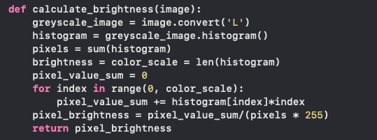

# 7 project

# Method explainations:

Main tasks of this project are performed by crop and calculate_brightness methods:

### Prerequisites for the project:
(
    to be determined, yet, python installed, as well as pillow and matplotlib libraries 
    (
    pip3 install --upgrade matplotlib
    pip3 install --upgrade Pillow
    )
)
## crop method

 
    Arguments of this method:
        • im - image to be cropped
        • height - prefered hright of image tiles
        • width - prefered width of image tiles
        • image_tiles - empty list to store tiles of the cropped image
        • image_text - optional argument for naming convenience of cropped images

Firstly, crop method  gets image's size and saves imgwidth and imgheight arguments.
Then a for loop with range argument is executed. Here, the starting point is 0, end point is <b>img_height</b> and step, with which i is going to be incremented on each iteration gets value of <b>height</b>, through which the loop is going to run is width. As a result, first for loop divides the image with vertical lines and second loop divides it with horizontal lines. This results in a grid for cropping the image. Once the horizontal and vertical lines for particular iteration are determined, coordinates of their calculated intersections are saved into <b>tile</b> tuple, which is then passed to pillow <b>im.crop</b> method, which crops this particular tile from the image. Lastly, croopped tile a is apprnded to the image_tiles list.

## calculate_brightness method

For this method, firstly, image is converted into grayscale mode with <b>'L'</b> argument. This means, we will get image object, where each pixel is represented by 8 bit value(0-255). 
Next, histogram method is used to represent frequency of pixel value occurances in the image (if there are 5 pixels in the image with value 124, then histogram[124] = 5)
Next, in the for loop, the program iterates through the histogram list and adds all the pixel values together in oder to get brightness ratio at the end (pixel_value_sum divided by pixels multiplied by 255).
